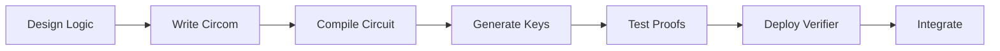

# Custom Circuits

Learn how to create your own zero-knowledge circuits tailored to your specific use case.

## When to Build Custom Circuits

Consider creating a custom circuit when:

- Existing templates don't match your requirements
- You need to verify unique business logic
- You want to optimize for specific constraints
- Your use case requires novel privacy guarantees

## Circuit Development Workflow



## Step 1: Design Your Logic

Define what you want to prove privately.

### Example: Credit Score Verification

**Goal:** Prove credit score is above a threshold without revealing exact score.

**Private Inputs:**
- `creditScore` - User's actual credit score

**Public Inputs:**
- `minScore` - Minimum required score

**Output:**
- `scoreValid` - 1 if score ≥ minScore, 0 otherwise

### Sketch the Circuit

```
Input: creditScore (private)
Input: minScore (public)

Check: creditScore >= minScore
Output: scoreValid (1 or 0)
```

## Step 2: Write the Circom Circuit

Create `credit_score.circom`:

```circom
pragma circom 2.0.0;

include "circomlib/circuits/comparators.circom";

template CreditScoreVerification() {
    // Private input
    signal input creditScore;

    // Public inputs
    signal input minScore;

    // Output
    signal output scoreValid;

    // Comparison component (32-bit integers)
    component gte = GreaterEqThan(32);

    // Check: creditScore >= minScore
    gte.in[0] <== creditScore;
    gte.in[1] <== minScore;

    // Output result
    scoreValid <== gte.out;
}

component main {public [minScore]} = CreditScoreVerification();
```

### Circuit Components

OpenZKTool includes `circomlib` with useful components:

| Component | Purpose | Example |
|-----------|---------|---------|
| `GreaterThan` | Compare numbers | `a > b` |
| `LessThan` | Compare numbers | `a < b` |
| `IsEqual` | Equality check | `a == b` |
| `Multiplexer` | Conditional selection | `if a then b else c` |
| `Poseidon` | Hash function | Hash private data |
| `ECDSA` | Signature verification | Verify signatures |

## Step 3: Compile the Circuit

```bash
# Create circuits directory
mkdir -p my-project/circuits

# Copy your circuit
cp credit_score.circom my-project/circuits/

# Compile
circom circuits/credit_score.circom \
  --r1cs \
  --wasm \
  --sym \
  --output circuits/build/
```

**Output:**
- `credit_score.r1cs` - Constraint system
- `credit_score.wasm` - Witness calculator
- `credit_score.sym` - Symbol table

## Step 4: Generate Trusted Setup Keys

### Option A: Use Powers of Tau (Recommended)

Use a universal trusted setup:

```bash
# Download Powers of Tau (one-time)
wget https://hermez.s3-eu-west-1.amazonaws.com/powersOfTau28_hez_final_15.ptau

# Generate circuit-specific keys
snarkjs groth16 setup \
  circuits/build/credit_score.r1cs \
  powersOfTau28_hez_final_15.ptau \
  circuits/build/credit_score_0000.zkey

# Contribute to phase 2 (optional but recommended)
snarkjs zkey contribute \
  circuits/build/credit_score_0000.zkey \
  circuits/build/credit_score_final.zkey \
  --name="Your contribution" \
  -v

# Export verification key
snarkjs zkey export verificationkey \
  circuits/build/credit_score_final.zkey \
  circuits/build/verification_key.json
```

### Option B: Custom Ceremony

For production deployments with high security requirements:

```bash
# Phase 1: Powers of Tau ceremony
snarkjs powersoftau new bn128 15 pot15_0000.ptau
snarkjs powersoftau contribute pot15_0000.ptau pot15_0001.ptau
# ... multiple contributors ...
snarkjs powersoftau beacon pot15_final.ptau
snarkjs powersoftau prepare phase2 pot15_final.ptau prepared.ptau

# Phase 2: Circuit-specific ceremony
snarkjs groth16 setup circuits/build/credit_score.r1cs prepared.ptau credit_score_0000.zkey
snarkjs zkey contribute credit_score_0000.zkey credit_score_final.zkey
```

## Step 5: Test Proof Generation

### Create Test Input

`test_input.json`:

```json
{
  "creditScore": "720",
  "minScore": "650"
}
```

### Generate and Verify

```bash
# Generate witness
node circuits/build/credit_score_js/generate_witness.js \
  circuits/build/credit_score_js/credit_score.wasm \
  test_input.json \
  witness.wtns

# Generate proof
snarkjs groth16 prove \
  circuits/build/credit_score_final.zkey \
  witness.wtns \
  proof.json \
  public.json

# Verify locally
snarkjs groth16 verify \
  circuits/build/verification_key.json \
  public.json \
  proof.json
```

**Expected Output:**
```
[INFO]  snarkJS: OK!
```

## Step 6: Export Soroban Verifier

Generate Rust code for Stellar deployment:

```bash
# Export Soroban contract
snarkjs zkey export soroban \
  circuits/build/credit_score_final.zkey \
  contracts/src/verifier.rs
```

**Output:** `verifier.rs` with embedded verification key

### Customize the Contract

Edit `contracts/src/lib.rs`:

```rust
#![no_std]
use soroban_sdk::{contract, contractimpl, Env, Vec};

mod verifier;
use verifier::verify_groth16;

#[contract]
pub struct CreditScoreVerifier;

#[contractimpl]
impl CreditScoreVerifier {
    pub fn verify(env: Env, proof: Vec<u8>) -> bool {
        // Call generated verifier
        verify_groth16(&env, proof)
    }

    pub fn check_credit(env: Env, applicant: Address, proof: Vec<u8>) -> bool {
        let valid = Self::verify(env.clone(), proof);

        if valid {
            log!(&env, "Credit check passed for: {}", applicant);
        }

        valid
    }
}
```

## Step 7: Deploy to Stellar

```bash
# Build contract
cd contracts
cargo build --target wasm32-unknown-unknown --release

# Optimize
wasm-opt --strip-debug -Oz \
  target/wasm32-unknown-unknown/release/credit_score_verifier.wasm \
  -o verifier-optimized.wasm

# Deploy
soroban contract deploy \
  --wasm verifier-optimized.wasm \
  --source YOUR_SECRET_KEY \
  --network testnet
```

## Advanced Techniques

### 1. Range Proofs

Prove a value is within a range:

```circom
template RangeProof(n) {
    signal input value;
    signal input min;
    signal input max;
    signal output inRange;

    component gte = GreaterEqThan(n);
    component lte = LessEqThan(n);

    gte.in[0] <== value;
    gte.in[1] <== min;

    lte.in[0] <== value;
    lte.in[1] <== max;

    inRange <== gte.out * lte.out;  // AND gate
}
```

### 2. Set Membership

Prove a value is in an allowed set:

```circom
template SetMembership(setSize) {
    signal input value;
    signal input allowedValues[setSize];
    signal output isMember;

    component eq[setSize];
    signal matches[setSize];

    for (var i = 0; i < setSize; i++) {
        eq[i] = IsEqual();
        eq[i].in[0] <== value;
        eq[i].in[1] <== allowedValues[i];
        matches[i] <== eq[i].out;
    }

    // OR gate: at least one match
    signal or[setSize];
    or[0] <== matches[0];
    for (var i = 1; i < setSize; i++) {
        or[i] <== or[i-1] + matches[i] - (or[i-1] * matches[i]);
    }

    isMember <== or[setSize - 1];
}
```

### 3. Merkle Tree Verification

Prove membership in a large set efficiently:

```circom
include "circomlib/circuits/poseidon.circom";

template MerkleTreeVerifier(levels) {
    signal input leaf;
    signal input pathElements[levels];
    signal input pathIndices[levels];
    signal input root;

    component hashers[levels];
    signal levelHashes[levels + 1];

    levelHashes[0] <== leaf;

    for (var i = 0; i < levels; i++) {
        hashers[i] = Poseidon(2);

        // Left or right based on path index
        hashers[i].inputs[0] <== levelHashes[i] * (1 - pathIndices[i]) +
                                  pathElements[i] * pathIndices[i];
        hashers[i].inputs[1] <== pathElements[i] * (1 - pathIndices[i]) +
                                  levelHashes[i] * pathIndices[i];

        levelHashes[i + 1] <== hashers[i].out;
    }

    root === levelHashes[levels];
}
```

## Optimization Tips

### 1. Minimize Constraints

More constraints = larger proofs + slower generation.

**Bad:**
```circom
signal intermediate1 <== a * b;
signal intermediate2 <== intermediate1 * c;
signal result <== intermediate2 * d;
```

**Good:**
```circom
signal result <== a * b * c * d;
```

### 2. Use Efficient Components

Prefer built-in circomlib components:

| Operation | Efficient | Inefficient |
|-----------|-----------|-------------|
| Comparison | `GreaterThan` | Manual bit decomposition |
| Hashing | `Poseidon` | SHA256 (many constraints) |
| Conditionals | `Mux1` | Custom if/else logic |

### 3. Batch Operations

Process multiple items in one circuit:

```circom
template BatchVerifier(n) {
    signal input values[n];
    signal input minValues[n];
    signal output allValid;

    component checks[n];
    signal results[n];

    for (var i = 0; i < n; i++) {
        checks[i] = GreaterEqThan(32);
        checks[i].in[0] <== values[i];
        checks[i].in[1] <== minValues[i];
        results[i] <== checks[i].out;
    }

    // AND all results
    signal and[n];
    and[0] <== results[0];
    for (var i = 1; i < n; i++) {
        and[i] <== and[i-1] * results[i];
    }

    allValid <== and[n-1];
}
```

## Testing Best Practices

### 1. Unit Test Components

```bash
# Test individual components
circom test_component.circom --test
```

### 2. Integration Testing

```typescript
import { wasm as wasm_tester } from "circom_tester";

describe("Credit Score Circuit", function () {
    let circuit;

    before(async function () {
        circuit = await wasm_tester("circuits/credit_score.circom");
    });

    it("should verify valid credit score", async function () {
        const witness = await circuit.calculateWitness({
            creditScore: "720",
            minScore: "650"
        });

        await circuit.checkConstraints(witness);
        await circuit.assertOut(witness, { scoreValid: 1 });
    });

    it("should reject invalid credit score", async function () {
        const witness = await circuit.calculateWitness({
            creditScore: "600",
            minScore: "650"
        });

        await circuit.assertOut(witness, { scoreValid: 0 });
    });
});
```

### 3. Fuzzing

Test with random inputs:

```typescript
for (let i = 0; i < 1000; i++) {
    const creditScore = Math.floor(Math.random() * 850);
    const minScore = 650;

    const witness = await circuit.calculateWitness({
        creditScore: creditScore.toString(),
        minScore: minScore.toString()
    });

    const expected = creditScore >= minScore ? 1 : 0;
    await circuit.assertOut(witness, { scoreValid: expected });
}
```

## Security Considerations

### 1. Soundness

Ensure constraints fully enforce your logic:

```circom
// BAD: Doesn't constrain the result
signal output result;
result <-- a + b;  // <-- is unconstrained assignment

// GOOD: Properly constrains
signal output result;
result <== a + b;  // <== adds constraint
```

### 2. Underflow/Overflow

Be careful with field arithmetic:

```circom
// Field elements wrap around
// 0 - 1 = p - 1 (large number)

// Use safe comparison
component gte = GreaterEqThan(32);
gte.in[0] <== a;
gte.in[1] <== b;
```

### 3. Input Validation

Validate all inputs in constraints:

```circom
template SafeCircuit() {
    signal input age;
    signal output valid;

    // Ensure age is reasonable (0-150)
    component rangeCheck = LessEqThan(8);
    rangeCheck.in[0] <== age;
    rangeCheck.in[1] <== 150;

    valid <== rangeCheck.out;
}
```

## Common Pitfalls

### 1. Unconstrained Signals

```circom
// BAD
signal x;
x <-- a * b;  // x is not constrained!

// GOOD
signal x;
x <== a * b;  // x is constrained to equal a * b
```

### 2. Division

```circom
// Division is not directly supported
// Use inverse multiplication instead

signal inverse;
inverse <== 1 / divisor;  // Computed off-circuit
divisor * inverse === 1;   // Constraint checks it's correct
```

### 3. Non-Deterministic Operations

```circom
// BAD: Random values
signal random <-- Math.random();

// GOOD: Deterministic from inputs
signal hash <== Poseidon([input1, input2]);
```

## Next Steps

- **[Deploy to Stellar →](../stellar-integration/deployment)** - Production deployment
- **[Performance Optimization →](./performance)** - Advanced optimization techniques
- **[Security Audit →](./security)** - Prepare for audit

---

**Questions?** [GitHub Discussions](https://github.com/xcapit/openzktool/discussions)
