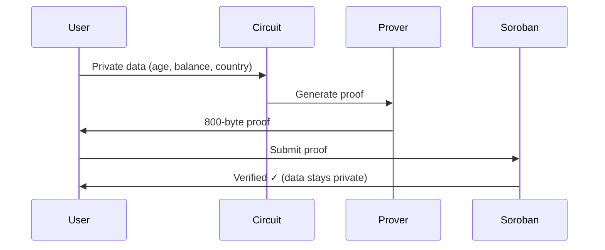

# Quick Start

Generate your first zero-knowledge proof in under 5 minutes!

## Your First Proof

Let's prove that someone is over 18, has sufficient balance, and is from an allowed country - **without revealing their actual age, balance, or location**.

###

 1. Run the Demo

```bash
cd openzktool
npm run demo:privacy
```

### 2. What Just Happened?

The demo:
1. Generated a proof with **private** inputs (age: 25, balance: $150, country: Argentina)
2. Verified constraints: age ≥ 18, balance ≥ $50, country in allowed list
3. Output: `kycValid = 1` (passed) ✓

**The magic:** The verifier knows requirements are met, but NOT the actual values!

## Manual Proof Generation

Want to generate proofs programmatically? Here's how:

### Step 1: Create Input File

Create `my_input.json`:

```json
{
  "age": "25",
  "balance": "150",
  "country": "11",
  "minAge": "18",
  "maxAge": "99",
  "minBalance": "50",
  "allowedCountries": ["11", "1", "5", "0", "0", "0", "0", "0", "0", "0"]
}
```

**Note:** All values are strings (Circom requirement).

### Step 2: Generate Proof

```bash
npm run prove
```

This creates:
- `circuits/build/proof.json` - The ZK proof (800 bytes)
- `circuits/build/public.json` - Public outputs (kycValid)

### Step 3: Verify Locally

```bash
snarkjs groth16 verify \
  circuits/build/verification_key.json \
  circuits/build/public.json \
  circuits/build/proof.json
```

Output: `[INFO]  snarkJS: OK!` ✓

## Verify on Stellar Soroban

Now let's verify the proof on-chain using our deployed contract:

```bash
npm run demo:soroban
```

This:
1. Connects to Stellar testnet
2. Calls the verifier contract
3. Returns verification result

**Contract:** `CBPBVJJW5NMV4UVEDKSR6UO4DRBNWRQEMYKRYZI3CW6YK3O7HAZA43OI`

## Understanding the Flow



## What's in a Proof?

A proof consists of three elliptic curve points:

```json
{
  "pi_a": ["...", "..."],     // Point A on curve
  "pi_b": [["...", "..."]],   // Point B on curve
  "pi_c": ["...", "..."],     // Point C on curve
  "protocol": "groth16",
  "curve": "bn128"
}
```

**Size:** ~800 bytes (constant, regardless of input complexity!)

## Common Use Cases

### Age Verification (18+)

```bash
cat > age_check.json << EOF
{
  "age": "22",
  "balance": "0",
  "country": "0",
  "minAge": "18",
  "maxAge": "99",
  "minBalance": "0",
  "allowedCountries": ["0", "0", "0", "0", "0", "0", "0", "0", "0", "0"]
}
EOF

# Generate proof
snarkjs groth16 fullprove age_check.json \
  circuits/build/kyc_transfer_js/kyc_transfer.wasm \
  circuits/build/kyc_transfer_final.zkey \
  proof.json \
  public.json
```

### Minimum Balance Check

```bash
cat > balance_check.json << EOF
{
  "age": "0",
  "balance": "5000",
  "country": "0",
  "minAge": "0",
  "maxAge": "999",
  "minBalance": "1000",
  "allowedCountries": ["0", "0", "0", "0", "0", "0", "0", "0", "0", "0"]
}
EOF
```

### Geographic Compliance

```bash
cat > geo_check.json << EOF
{
  "age": "0",
  "balance": "0",
  "country": "1",
  "minAge": "0",
  "maxAge": "999",
  "minBalance": "0",
  "allowedCountries": ["1", "5", "11", "0", "0", "0", "0", "0", "0", "0"]
}
EOF
```

## Performance

Typical timings on modern hardware:

| Operation | Time |
|-----------|------|
| Proof generation | < 1 second |
| Local verification | < 50ms |
| On-chain verification | ~200ms |

## Troubleshooting

### "WASM file not found"

Make sure you ran `npm run setup` first to compile circuits.

### "Invalid witness"

Check that all input values are strings and within valid ranges.

### "Verification failed"

Ensure public inputs match between proof generation and verification.

## Next Steps

- **[Stellar Integration →](../stellar-integration/overview)** - Deploy your own verifier
- **[Circuit Templates →](../circuit-templates/kyc-transfer)** - Explore other circuits
- **[Custom Circuits →](../advanced/custom-circuits)** - Build your own

---

**Questions?** [Ask on GitHub Discussions](https://github.com/xcapit/openzktool/discussions)
