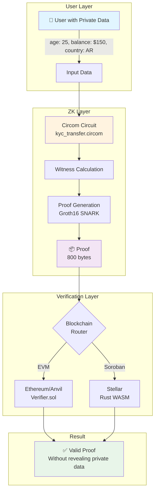
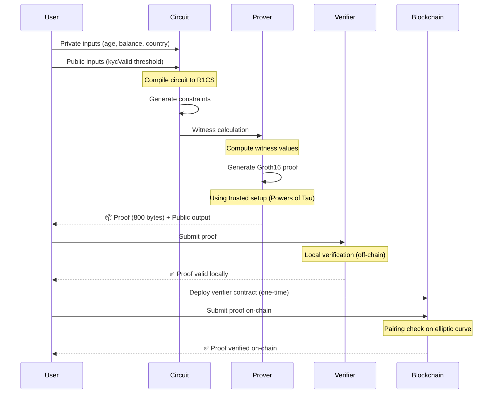
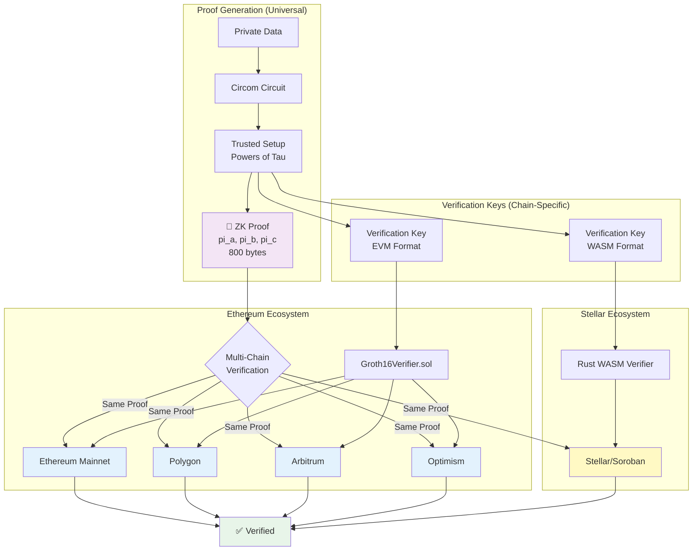
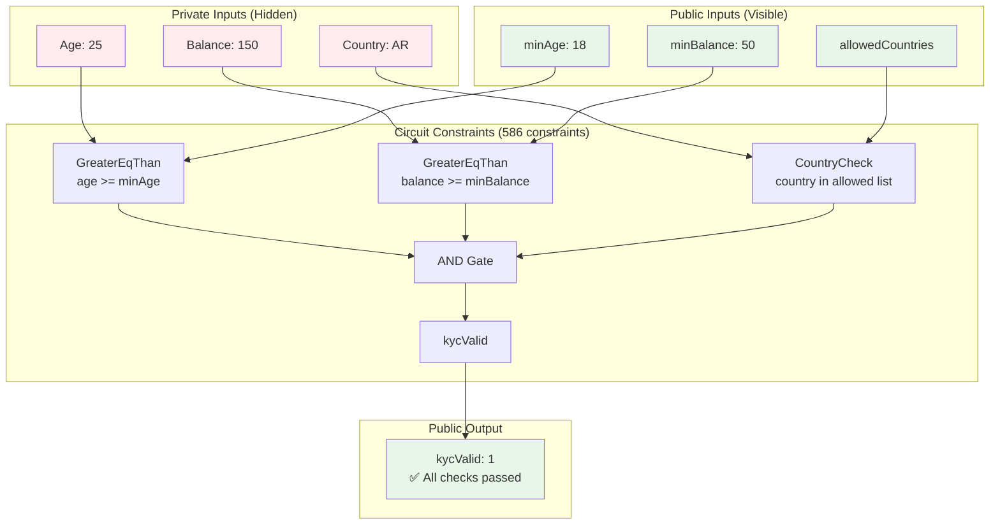
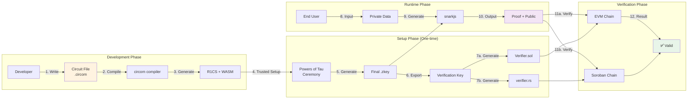
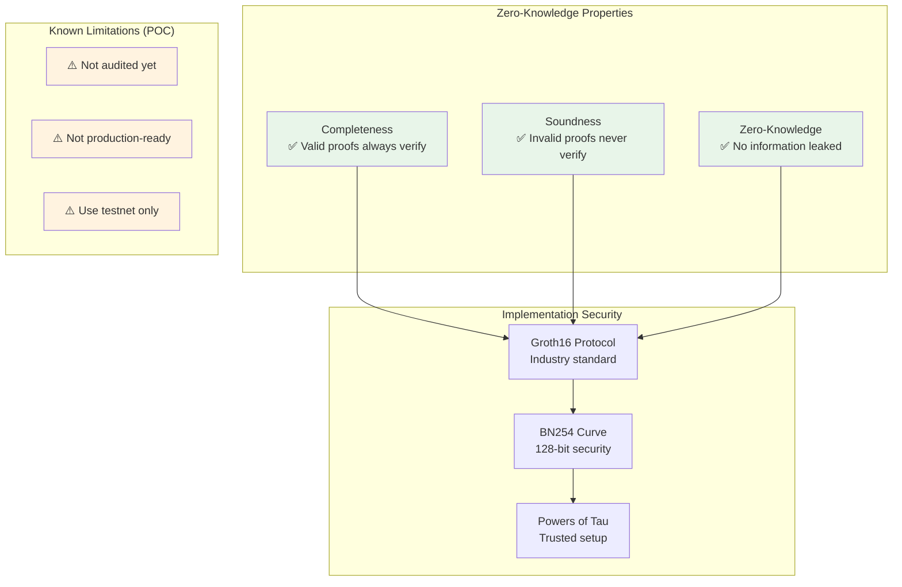

# 🏗️ ZKPrivacy Architecture Overview

This document provides a comprehensive visual overview of the ZKPrivacy system architecture.

---

## 📊 Table of Contents

1. [System Overview](#system-overview)
2. [Proof Generation & Verification Flow](#proof-generation--verification-flow)
3. [Multi-Chain Architecture](#multi-chain-architecture)
4. [Circuit Structure](#circuit-structure)
5. [Component Interaction](#component-interaction)

---

## 🎯 System Overview

High-level view of the entire ZKPrivacy system:



**Key Points:**
- 🔐 Private data never leaves the user's control
- ⚡ Proof generation takes <1 second
- 🌐 Same proof works on multiple blockchains
- ✅ Verification confirms compliance without revealing data

---

## 🔄 Proof Generation & Verification Flow

Detailed step-by-step flow:



**Timeline:**
1. **Setup Phase** (one-time): ~2-3 minutes
   - Compile circuit
   - Generate trusted setup
   - Export verification key

2. **Proof Phase** (per transaction): <1 second
   - Calculate witness
   - Generate proof
   - Verify locally

3. **On-Chain Phase**: ~50ms (off-chain) or ~200k gas (on-chain)
   - Submit to blockchain
   - Contract verification
   - Result recorded

---

## 🌐 Multi-Chain Architecture

How the same proof works across different blockchains:



**Key Insight:**
- ✅ **One proof, many chains** - The same 800-byte proof can be verified on any blockchain
- 🔑 **Verification key** is chain-specific (Solidity for EVM, Rust/WASM for Soroban)
- 🌍 **True interoperability** - Privacy doesn't lock you into one ecosystem

---

## 🔧 Circuit Structure

Internal structure of the KYC transfer circuit:



**Constraint Breakdown:**
- `GreaterEqThan` circuits: ~200 constraints each
- `CountryCheck` (hash + comparison): ~150 constraints
- `AND` logic gates: ~36 constraints
- **Total:** 586 constraints (very efficient!)

**Circuit File:** `circuits/kyc_transfer.circom`

---

## 🔗 Component Interaction

How all components work together in practice:



**File Dependencies:**

```
project/
├── circuits/
│   ├── kyc_transfer.circom          # Source circuit
│   └── artifacts/
│       ├── kyc_transfer.r1cs        # Compiled circuit
│       ├── kyc_transfer.wasm        # Witness generator
│       ├── kyc_transfer_final.zkey  # Proving key
│       ├── kyc_transfer_vkey.json   # Verification key
│       ├── proof.json               # Generated proof
│       └── public.json              # Public signals
├── evm-verification/
│   └── src/
│       └── Verifier.sol             # EVM verifier
└── soroban/
    └── src/
        └── lib.rs                   # Soroban verifier
```

---

## 📈 Performance Metrics

| Metric | Value | Notes |
|--------|-------|-------|
| **Proof Size** | 800 bytes | Constant, regardless of input |
| **Generation Time** | <1 second | On modern hardware |
| **Verification Time (off-chain)** | <50ms | Local snarkjs |
| **Verification Gas (EVM)** | ~200,000 | ~$5-10 at 50 gwei |
| **Circuit Constraints** | 586 | Very efficient |
| **Trusted Setup** | Universal | Reuse existing ceremonies |
| **Supported Chains** | 2+ | Ethereum + Stellar (more coming) |

---

## 🔐 Security Properties



---

## 🎯 Next Steps

- 📖 Read the [Getting Started Guide](../getting-started/quickstart.md)
- 🧪 Try the [Interactive Tutorial](../getting-started/interactive-tutorial.md)
- 💻 Check [Integration Examples](../../examples/)
- 🔧 Learn about [Custom Circuits](../guides/custom-circuits.md)

---

## 📚 References

- [Groth16 Paper](https://eprint.iacr.org/2016/260.pdf)
- [Circom Documentation](https://docs.circom.io/)
- [snarkjs Repository](https://github.com/iden3/snarkjs)
- [Powers of Tau Ceremony](https://github.com/privacy-scaling-explorations/perpetualpowersoftau)

---

**Questions?** Open an issue or check the [FAQ](../FAQ.md)
