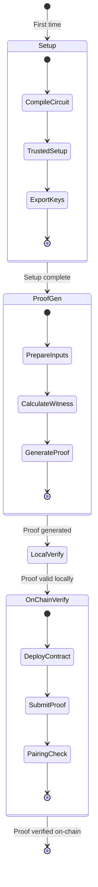
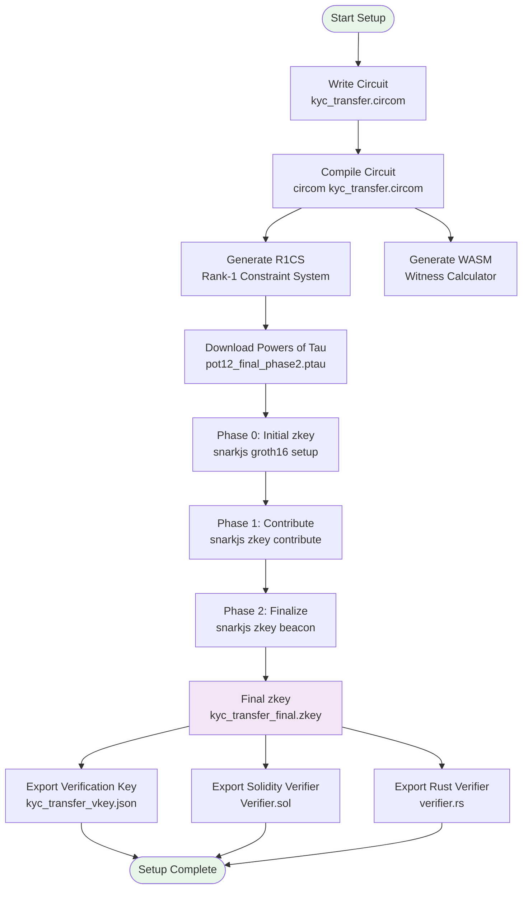
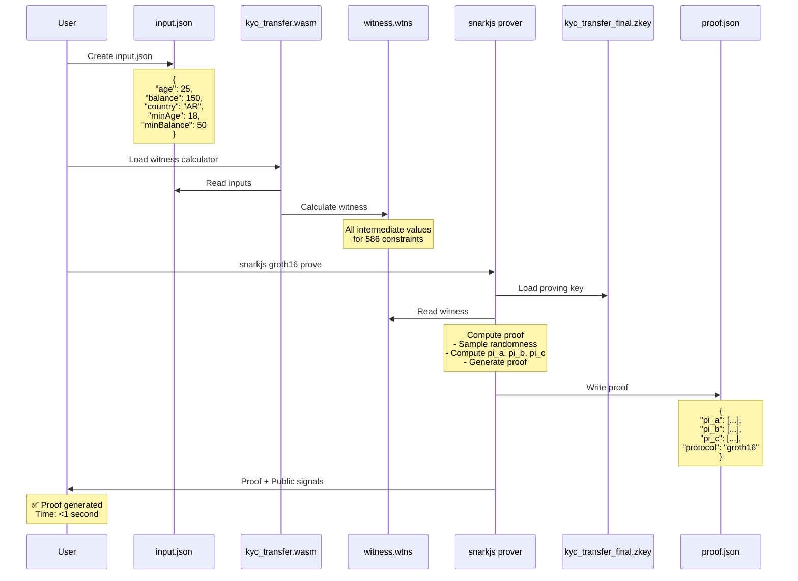
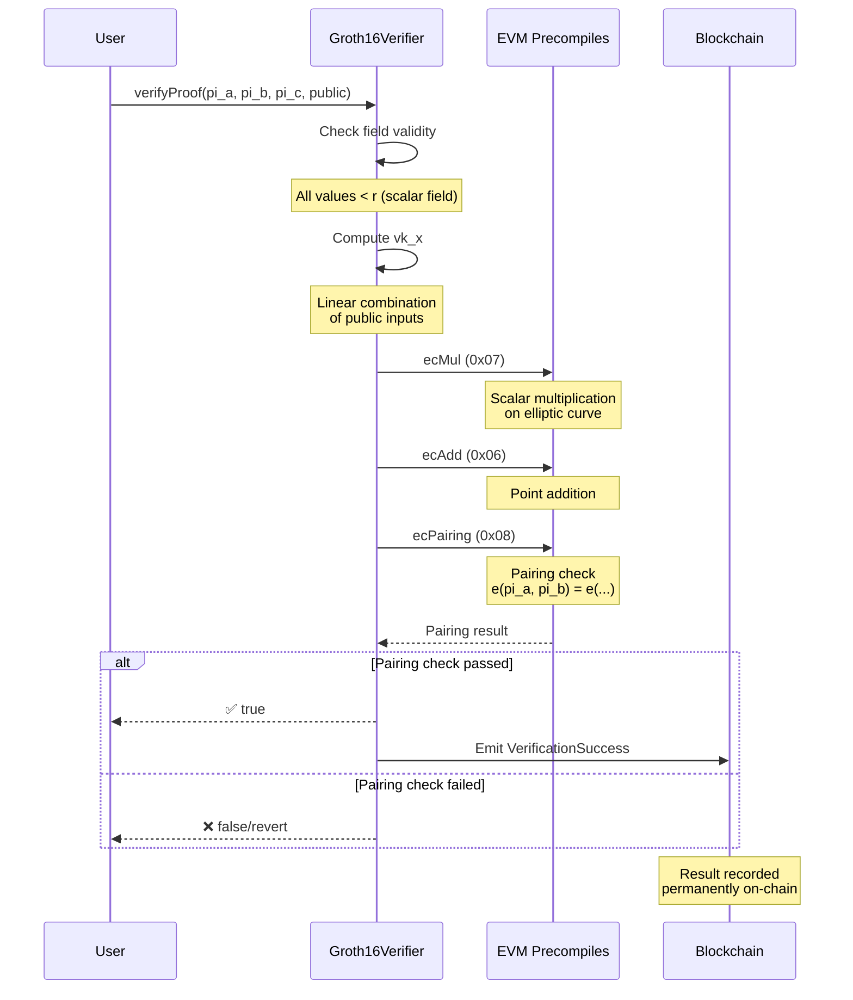

# 🔄 Proof Generation & Verification Flow

Detailed technical flow of how ZK proofs are generated and verified in OpenZKTool.

---

## 📋 Quick Navigation

- [Overview](#overview)
- [Phase 1: Setup (One-time)](#phase-1-setup-one-time)
- [Phase 2: Proof Generation](#phase-2-proof-generation)
- [Phase 3: Local Verification](#phase-3-local-verification)
- [Phase 4: On-Chain Verification](#phase-4-on-chain-verification)
- [Data Flow Example](#data-flow-example)

---

## 🎯 Overview



---

## 🔧 Phase 1: Setup (One-time)

This phase only runs once per circuit. Results are reused for all subsequent proofs.



### Commands

```bash
# 1. Compile circuit
circom kyc_transfer.circom --r1cs --wasm --sym

# 2. Download trusted setup
wget https://hermez.s3-eu-west-1.amazonaws.com/pot12_final_phase2.ptau

# 3. Generate initial zkey
snarkjs groth16 setup kyc_transfer.r1cs pot12_final_phase2.ptau kyc_transfer_0000.zkey

# 4. Contribute to ceremony
snarkjs zkey contribute kyc_transfer_0000.zkey kyc_transfer_0001.zkey --name="First contribution"

# 5. Finalize zkey
snarkjs zkey beacon kyc_transfer_0001.zkey kyc_transfer_final.zkey 0102030405060708090a0b0c0d0e0f101112131415161718191a1b1c1d1e1f 10

# 6. Export verification key
snarkjs zkey export verificationkey kyc_transfer_final.zkey kyc_transfer_vkey.json

# 7. Export Solidity verifier
snarkjs zkey export solidityverifier kyc_transfer_final.zkey Verifier.sol
```

### Output Files

```
circuits/artifacts/
├── kyc_transfer.r1cs          # 156 KB - Constraint system
├── kyc_transfer_js/
│   └── kyc_transfer.wasm      # 89 KB - Witness calculator
├── kyc_transfer_final.zkey    # 324 KB - Proving key
└── kyc_transfer_vkey.json     # 3 KB - Verification key
```

---

## ⚡ Phase 2: Proof Generation

This runs every time a user needs to generate a proof.



### Input Format

```json
{
  "age": 25,
  "balance": 150,
  "country": 11,
  "minAge": 18,
  "minBalance": 50,
  "allowedCountries": [11, 1, 5]
}
```

### Output Format

```json
{
  "pi_a": [
    "12345...",
    "67890...",
    "1"
  ],
  "pi_b": [
    ["...", "..."],
    ["...", "..."],
    ["1", "0"]
  ],
  "pi_c": [
    "12345...",
    "67890...",
    "1"
  ],
  "protocol": "groth16",
  "curve": "bn128"
}
```

**Public Signals:**
```json
["1"]  // kycValid = 1 (passed all checks)
```

### Commands

```bash
# Calculate witness
node kyc_transfer_js/generate_witness.js \
  kyc_transfer_js/kyc_transfer.wasm \
  input.json \
  witness.wtns

# Generate proof
snarkjs groth16 prove \
  kyc_transfer_final.zkey \
  witness.wtns \
  proof.json \
  public.json

# Time: ~500ms on modern hardware
```

---

## ✅ Phase 3: Local Verification

Quick verification before submitting on-chain (saves gas if proof is invalid).

```mermaid
flowchart LR
    PROOF[proof.json] --> VERIFIER[snarkjs verifier]
    PUBLIC[public.json] --> VERIFIER
    VKEY[kyc_transfer_vkey.json] --> VERIFIER

    VERIFIER --> CHECK1{Check curve points<br/>are valid}
    CHECK1 -->|Invalid| FAIL[❌ Verification Failed]
    CHECK1 -->|Valid| CHECK2{Pairing equation}

    CHECK2 --> PAIRING[e(pi_a, pi_b) =<br/>e(alpha, beta) *<br/>e(vk_x, gamma) *<br/>e(pi_c, delta)]

    PAIRING -->|False| FAIL
    PAIRING -->|True| SUCCESS[✅ Proof Valid]

    style SUCCESS fill:#e8f5e9
    style FAIL fill:#ffebee
```

### Command

```bash
snarkjs groth16 verify \
  kyc_transfer_vkey.json \
  public.json \
  proof.json

# Output: [INFO]  snarkJS: OK!
# Time: <50ms
```

### What's Checked

1. **Point validity:** All elliptic curve points are on BN254
2. **Public signals:** Match the proof
3. **Pairing equation:** The core ZK verification

```
e(π_A, π_B) = e(α, β) · e(L, γ) · e(π_C, δ)

Where:
- π_A, π_B, π_C = proof elements
- α, β, γ, δ = verification key elements
- L = linear combination of public inputs
- e() = pairing function
```

---

## ⛓️ Phase 4: On-Chain Verification

Submit proof to blockchain for permanent, trustless verification.



### Solidity Contract

```solidity
contract Groth16Verifier {
    function verifyProof(
        uint[2] memory a,
        uint[2][2] memory b,
        uint[2] memory c,
        uint[1] memory input
    ) public view returns (bool) {
        // 1. Check all values are in field
        // 2. Compute linear combination vk_x
        // 3. Call pairing precompile (0x08)
        // 4. Return result
    }
}
```

### Gas Costs (Ethereum)

| Operation | Gas Cost |
|-----------|----------|
| ecMul (0x07) | 6,000 |
| ecAdd (0x06) | 500 |
| ecPairing (0x08) | 113,000 (base) + 34,000 per pair |
| **Total** | **~200,000 gas** |

At 50 gwei gas price: **~$5-10 USD**

### Deployment

```bash
# EVM (Foundry)
forge create --rpc-url <RPC> \
  --private-key <KEY> \
  src/Verifier.sol:Groth16Verifier

# Soroban (Stellar)
stellar contract deploy \
  --wasm target/wasm32-unknown-unknown/release/verifier.wasm \
  --source alice \
  --network testnet
```

---

## 📊 Data Flow Example

Complete end-to-end example with Alice's data:

```mermaid
graph TD
    subgraph "1. Alice's Private Data"
        P1[Age: 25]
        P2[Balance: $150]
        P3[Country: Argentina]
    end

    subgraph "2. Public Requirements"
        R1[Age ≥ 18]
        R2[Balance ≥ $50]
        R3[Country in allowed list]
    end

    subgraph "3. Circuit Processing"
        P1 --> C1[25 ≥ 18? ✅]
        R1 --> C1

        P2 --> C2[150 ≥ 50? ✅]
        R2 --> C2

        P3 --> C3[AR in list? ✅]
        R3 --> C3

        C1 --> AND[AND Gate]
        C2 --> AND
        C3 --> AND

        AND --> OUT[kycValid = 1]
    end

    subgraph "4. Proof Generation"
        OUT --> WITNESS[Witness:<br/>All 586 constraint values]
        WITNESS --> GROTH[Groth16 Prover]
        GROTH --> PROOF[Proof:<br/>pi_a: 123...<br/>pi_b: [[456...]]<br/>pi_c: 789...]
    end

    subgraph "5. Public Output"
        PROOF --> VERIFY[Verifier receives]
        OUT --> VERIFY
        VERIFY --> RESULT[✅ Valid proof<br/>kycValid = 1]
    end

    subgraph "6. What's Hidden"
        HIDDEN1[❌ Age: 25]
        HIDDEN2[❌ Balance: $150]
        HIDDEN3[❌ Country: AR]
    end

    style P1 fill:#ffebee
    style P2 fill:#ffebee
    style P3 fill:#ffebee
    style OUT fill:#e8f5e9
    style RESULT fill:#e8f5e9
    style HIDDEN1 fill:#ffebee
    style HIDDEN2 fill:#ffebee
    style HIDDEN3 fill:#ffebee
```

### What the Verifier Sees

```json
{
  "proof": "0x1234...abcd",  // 800 bytes
  "publicSignals": [1]        // kycValid = 1
}
```

### What the Verifier Does NOT See

- ❌ Alice's exact age (25)
- ❌ Alice's exact balance ($150)
- ❌ Alice's country (Argentina)
- ❌ Any intermediate calculation values

**Zero-Knowledge Property:** The verifier learns NOTHING except that the statement is true!

---

## 🎯 Performance Summary

| Phase | Time | Cost | Frequency |
|-------|------|------|-----------|
| Setup | 2-3 min | Free | One-time per circuit |
| Proof Generation | <1 sec | Free | Per transaction |
| Local Verification | <50ms | Free | Optional |
| On-Chain (EVM) | ~1 sec | ~200k gas | Per verification |
| On-Chain (Soroban) | ~1 sec | Minimal | Per verification |

---

## 🔐 Security Guarantees

1. **Completeness:** Valid proofs always verify
2. **Soundness:** Invalid proofs never verify (except with negligible probability)
3. **Zero-Knowledge:** Verifier learns nothing beyond the public output

---

## 📚 Learn More

- [Circuit Structure](./circuit-structure.md)
- [Multi-Chain Architecture](./multi-chain.md)
- [Integration Guide](../guides/integration-guide.md)
- [API Reference](../api/sdk-reference.md)

---

**Ready to generate your first proof?** Follow the [Quick Start Guide](../getting-started/quickstart.md)!
