# 🎮 Interactive Tutorial: Your First Privacy Proof

**Build and verify a Zero-Knowledge Proof in 10 minutes**

---

## 🎯 What You'll Learn

By the end of this tutorial, you'll be able to:
- ✅ Generate a ZK proof that proves age ≥ 18 without revealing exact age
- ✅ Verify proofs locally (off-chain)
- ✅ Verify proofs on Ethereum (EVM)
- ✅ Verify proofs on Stellar (Soroban)
- ✅ Understand how multi-chain ZK works

**Time commitment:** ~10 minutes
**Difficulty:** Beginner-friendly 🟢

---

## 📋 Prerequisites Check

Before starting, make sure you have:

- [ ] **Node.js** (v18 or higher) - [Download here](https://nodejs.org/)
- [ ] **npm** (comes with Node.js)
- [ ] **Git** - [Download here](https://git-scm.com/)
- [ ] **Foundry** (for EVM verification) - [Install here](https://book.getfoundry.sh/getting-started/installation)
- [ ] **Stellar CLI** (for Soroban verification) - [Install here](https://developers.stellar.org/docs/tools/developer-tools)
- [ ] **Docker** (for local Stellar network) - [Download here](https://www.docker.com/)

**Quick check:**
```bash
node --version   # Should show v18+
npm --version    # Should show 8+
git --version    # Any recent version
forge --version  # Foundry installed
stellar --version # Stellar CLI installed
docker --version # Docker installed
```

✅ **All good?** Let's start! 🚀

---

## 🎬 Step 1: Clone and Install (⏱️ 1 min)

### 1.1 Clone the repository

```bash
git clone https://github.com/xcapit/stellar-privacy-poc.git
cd stellar-privacy-poc
```

**What you just did:** Downloaded the OpenZKTool codebase to your machine.

---

### 1.2 Install dependencies

```bash
npm install
```

**Expected output:**
```
added 157 packages in 23s
```

**What you learned:** ✅ OpenZKTool is a standard Node.js project - easy to set up!

---

## ⚙️ Step 2: One-Time Circuit Setup (⏱️ 2-3 min)

### 2.1 Run the setup script

```bash
npm run setup
```

**What's happening?**
1. Compiling the Circom circuit (`kyc_transfer.circom`)
2. Generating R1CS (constraint system)
3. Creating WASM witness calculator
4. Downloading Powers of Tau (trusted setup)
5. Generating proving key (zkey file)
6. Exporting verification key

**Expected output:**
```
🔧 Setting up OpenZKTool circuits...
✅ Circuit compiled successfully
✅ Powers of Tau downloaded
✅ Proving key generated
✅ Verification key exported
🎉 Setup complete!
```

**What you learned:**
- ✅ Circuits need a one-time "trusted setup"
- ✅ This generates keys for proving and verification
- ✅ Setup only runs once - all future proofs reuse these keys

**Files created:**
```
circuits/artifacts/
├── kyc_transfer.r1cs          # Constraint system (156 KB)
├── kyc_transfer_js/
│   └── kyc_transfer.wasm      # Witness calculator (89 KB)
├── kyc_transfer_final.zkey    # Proving key (324 KB)
└── kyc_transfer_vkey.json     # Verification key (3 KB)
```

---

## 🔐 Step 3: Generate Your First Proof (⏱️ 1 min)

### 3.1 Check the input data

Open `circuits/artifacts/input.json`:

```json
{
  "age": 25,
  "balance": 150,
  "country": 11,
  "minAge": 18,
  "minBalance": 50,
  "allowedCountries": [11, 1, 5]
}
```

**What this proves:**
- Alice is 25 years old (**private**)
- Alice has $150 balance (**private**)
- Alice is from country 11/Argentina (**private**)
- Alice passes KYC: age ≥ 18, balance ≥ $50, country allowed (**public result**)

---

### 3.2 Generate the proof

```bash
cd circuits/scripts
bash prove_and_verify.sh
```

**Expected output:**
```
[INFO]  snarkJS: Reading zKey...
[INFO]  snarkJS: Computing witness...
[INFO]  snarkJS: Generating proof...
[INFO]  snarkJS: Writing proof...
✅ Proof generated: proof.json
✅ Public signals: ["1"]
[INFO]  snarkJS: OK! ✅
```

**What you learned:**
- ✅ Proof generation takes <1 second
- ✅ Public output is `["1"]` meaning `kycValid = 1` (passed)
- ✅ Private data (25, 150, 11) is **NOT** in the proof!

---

### 3.3 Inspect the proof

```bash
cat ../artifacts/proof.json
```

**You'll see:**
```json
{
  "pi_a": [
    "12345678901234567890...",
    "09876543210987654321...",
    "1"
  ],
  "pi_b": [ ... ],
  "pi_c": [ ... ],
  "protocol": "groth16",
  "curve": "bn128"
}
```

**What you learned:**
- ✅ The proof is just **3 elliptic curve points** (pi_a, pi_b, pi_c)
- ✅ Total size: ~800 bytes (tiny!)
- ✅ No private data visible anywhere in the proof

---

## ✅ Step 4: Verify Locally (⏱️ 10 seconds)

### 4.1 Run local verification

Still in `circuits/scripts/`:
```bash
bash prove_and_verify.sh
```

The script already verified! Look for:
```
[INFO]  snarkJS: OK! ✅
```

**What happened:**
1. Loaded the verification key (`kyc_transfer_vkey.json`)
2. Loaded the proof (`proof.json`)
3. Checked the pairing equation: `e(pi_a, pi_b) = e(α, β) · e(L, γ) · e(pi_c, δ)`
4. Result: ✅ Valid!

**What you learned:**
- ✅ Local verification is **instant** (<50ms)
- ✅ No blockchain needed for quick checks
- ✅ Same math that runs on-chain

---

## ⛓️ Step 5: Verify on Ethereum (⏱️ 30 seconds)

### 5.1 Start local Ethereum node

```bash
cd ../../evm-verification
anvil
```

**Expected output:**
```
Listening on 127.0.0.1:8545
```

**Keep this terminal open!** Anvil is your local Ethereum blockchain.

---

### 5.2 Deploy verifier contract and run test

Open a **new terminal**:
```bash
cd evm-verification
forge test -vv
```

**Expected output:**
```
[PASS] testVerifyProof() (gas: 234567)
Logs:
  Proof Verification Result: true

Test result: ok. 1 passed; 0 failed;
```

**What you learned:**
- ✅ Same proof verified on **Ethereum**!
- ✅ Smart contract checks the pairing equation
- ✅ Gas cost: ~200,000 gas (~$5-10 on mainnet)
- ✅ Uses EVM precompiles (0x06, 0x07, 0x08) for elliptic curve operations

**Contract code (`src/Verifier.sol`):**
```solidity
function verifyProof(
    uint[2] memory a,
    uint[2][2] memory b,
    uint[2] memory c,
    uint[1] memory input
) public view returns (bool) {
    // Pairing check using EVM precompiles
    return pairing(/* ... */);
}
```

---

## 🌟 Step 6: Verify on Stellar (⏱️ 1 min)

### 6.1 Start local Stellar network

```bash
cd ../soroban
bash verify_on_chain.sh
```

**What's happening:**
1. Starting Stellar quickstart Docker container
2. Waiting for Soroban RPC to be ready
3. Creating and funding test account (alice)
4. Building Rust WASM contract
5. Deploying verifier contract
6. Submitting proof for verification

**Expected output:**
```
🚀 Starting Stellar Quickstart...
✅ RPC is ready!
✅ Account funded successfully!
📦 Building contract...
🚀 Deploying contract...
✅ Contract deployed: CCXXXXXX...
🔍 Verifying proof...
✅ Verification result: true
```

**What you learned:**
- ✅ **Same proof** verified on **Stellar**!
- ✅ Different blockchain, same cryptographic proof
- ✅ Soroban uses Rust/WASM (not Solidity)
- ✅ Much cheaper than Ethereum (< $0.01)
- ✅ True multi-chain privacy! 🌐

**Contract code (`src/lib.rs`):**
```rust
pub fn verify(proof: Proof, public_inputs: Vec<U256>) -> bool {
    // Same pairing check, different language
    groth16_verify(&proof, &public_inputs)
}
```

---

## 🎨 Step 7: Experiment! (⏱️ 5 min)

Now that you've generated and verified your first proof, try modifying the inputs!

### 7.1 Test invalid inputs

Edit `circuits/artifacts/input.json`:

**Test 1: Underage**
```json
{
  "age": 16,  // Changed from 25
  "balance": 150,
  "country": 11,
  "minAge": 18,
  "minBalance": 50,
  "allowedCountries": [11, 1, 5]
}
```

Generate proof:
```bash
cd circuits/scripts
bash prove_and_verify.sh
```

**Expected result:**
```
✅ Proof generated: proof.json
✅ Public signals: ["0"]  ← kycValid = 0 (FAILED)
```

**What you learned:**
- ✅ Proof generation **always succeeds**
- ✅ But `kycValid = 0` shows the user failed KYC
- ✅ Verifier can check this and reject the transaction

---

**Test 2: Insufficient balance**
```json
{
  "age": 25,
  "balance": 30,  // Changed from 150
  "country": 11,
  "minAge": 18,
  "minBalance": 50,
  "allowedCountries": [11, 1, 5]
}
```

**Expected result:** `kycValid = 0` ❌

---

**Test 3: Disallowed country**
```json
{
  "age": 25,
  "balance": 150,
  "country": 99,  // Changed from 11
  "minAge": 18,
  "minBalance": 50,
  "allowedCountries": [11, 1, 5]
}
```

**Expected result:** `kycValid = 0` ❌

---

### 7.2 Test valid edge cases

**Test 4: Exactly at threshold**
```json
{
  "age": 18,  // Exactly minAge
  "balance": 50,  // Exactly minBalance
  "country": 11,
  "minAge": 18,
  "minBalance": 50,
  "allowedCountries": [11, 1, 5]
}
```

**Expected result:** `kycValid = 1` ✅

**What you learned:**
- ✅ `>=` constraint includes exact equality
- ✅ Alice with age=18 passes (18 >= 18)

---

## 🎓 Step 8: Understanding What Happened

Let's recap the entire flow:

```mermaid
sequenceDiagram
    participant You
    participant Circuit
    participant Prover
    participant Ethereum
    participant Stellar

    You->>Circuit: Private data (age: 25, balance: 150)
    Circuit->>Circuit: Check constraints (586 total)
    Circuit->>Prover: All checks passed → kycValid = 1
    Prover->>Prover: Generate Groth16 proof (800 bytes)
    Prover-->>You: proof.json + ["1"]

    You->>Ethereum: Submit proof
    Ethereum->>Ethereum: Pairing check (Solidity)
    Ethereum-->>You: ✅ Verified!

    You->>Stellar: Submit SAME proof
    Stellar->>Stellar: Pairing check (Rust/WASM)
    Stellar-->>You: ✅ Verified!
```



**Key insights:**

1. **Privacy preserved:**
   - Ethereum doesn't know your age (25), balance (150), or country (11)
   - Stellar doesn't know your age (25), balance (150), or country (11)
   - Both only know: `kycValid = 1` ✅

2. **Multi-chain magic:**
   - One proof (800 bytes)
   - Multiple blockchains
   - Same cryptographic guarantees

3. **Practical performance:**
   - Proof generation: <1 second
   - Local verification: <50ms
   - On-chain verification: ~200k gas (EVM) or minimal (Soroban)

---

## 🚀 Step 9: Next Steps

**Congratulations!** 🎉 You've successfully:
- ✅ Generated a Zero-Knowledge Proof
- ✅ Verified it locally
- ✅ Verified it on Ethereum
- ✅ Verified it on Stellar
- ✅ Understood multi-chain ZK privacy

### Where to go from here?

**For Developers:**
1. 📖 Read [Integration Guide](../guides/integration-guide.md) *(coming soon)*
2. 💻 Check [Integration Examples](../../examples/) *(coming soon)*
3. 🔧 Learn about [Custom Circuits](../guides/custom-circuits.md) *(coming soon)*

**For Researchers:**
1. 🏗️ Study [Architecture Overview](../architecture/overview.md)
2. 🔄 Deep dive into [Proof Flow](../architecture/proof-flow.md)
3. 📄 Read [Groth16 Paper](https://eprint.iacr.org/2016/260.pdf)

**For Contributors:**
1. 🐛 Report bugs or suggest features in [Issues](https://github.com/xcapit/stellar-privacy-poc/issues)
2. 📝 Improve documentation (submit a PR!)
3. ⭐ Star the repo and spread the word!

---

## 📚 Additional Resources

### Completed Tutorial Checklist

- [ ] Installed all prerequisites
- [ ] Cloned repository and installed dependencies
- [ ] Ran one-time circuit setup
- [ ] Generated first proof
- [ ] Verified proof locally
- [ ] Verified proof on Ethereum (Anvil)
- [ ] Verified proof on Stellar (Soroban)
- [ ] Experimented with different inputs
- [ ] Understood the multi-chain flow

**Completion time:** _________
**Difficulty:** Easy 🟢 / Medium 🟡 / Hard 🔴 *(circle one)*

---

### Troubleshooting

**Issue: "Module not found" errors**
```bash
# Solution: Reinstall dependencies
rm -rf node_modules package-lock.json
npm install
```

**Issue: "Account not found" on Soroban**
```bash
# Solution: Wait longer for Docker to initialize
docker ps  # Check if stellar-quickstart is running
docker logs stellar  # Check logs
```

**Issue: "Verification failed" on EVM**
```bash
# Solution: Regenerate Verifier.sol
npx snarkjs zkey export solidityverifier \
  circuits/artifacts/kyc_transfer_final.zkey \
  evm-verification/src/Verifier.sol
```

See [FAQ](../FAQ.md) for more troubleshooting tips.

---

### Learn More

- 🎥 [**Watch 7-min Video Demo**](https://drive.google.com/file/d/1SSQCAanCcpsVqp4rNuM3Vh6triRtknzt/view?usp=sharing)
- 📖 [Quick Start Guide](./quickstart.md)
- ❓ [FAQ](../FAQ.md)
- 🏗️ [Architecture Documentation](../architecture/)

---

## 💬 Feedback

**How was this tutorial?** We'd love to hear from you!

- 👍 Helpful? Star the repo: https://github.com/xcapit/stellar-privacy-poc
- 🐛 Found an issue? Report it: https://github.com/xcapit/stellar-privacy-poc/issues
- 💡 Have suggestions? Open a discussion!

---

*Tutorial version: 1.0*
*Last updated: 2025-01-10*
*Team X1 - Xcapit Labs*
